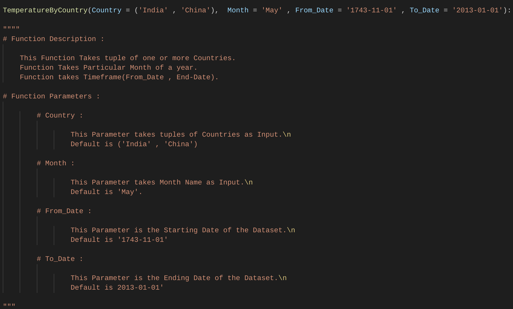
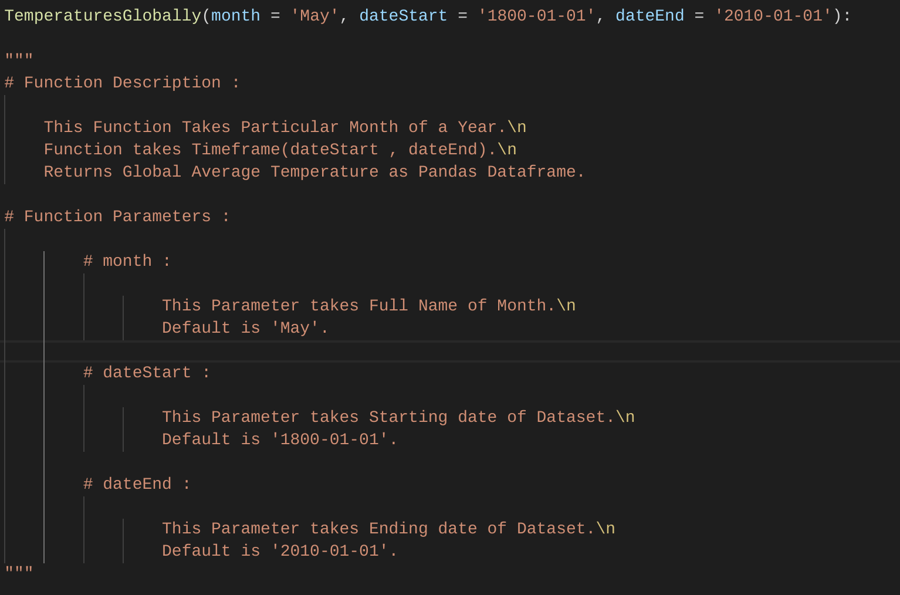
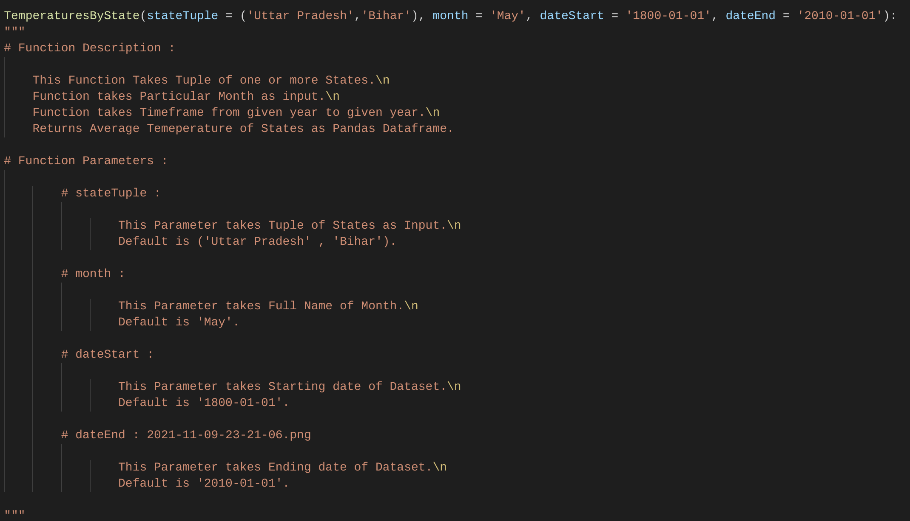
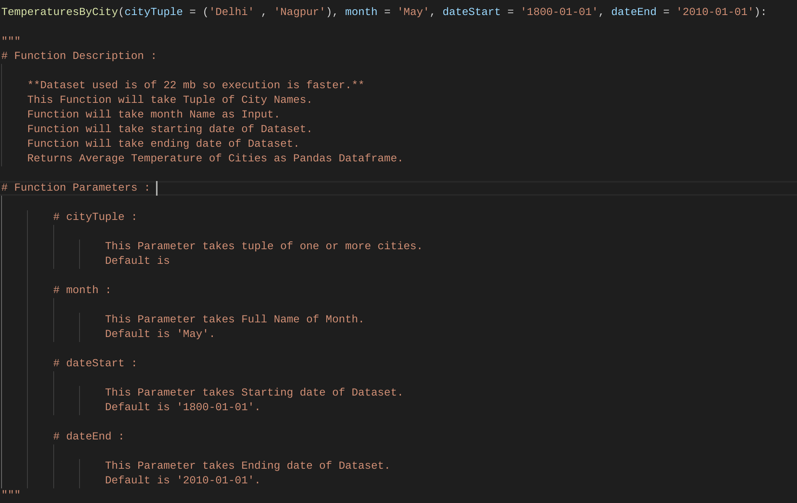
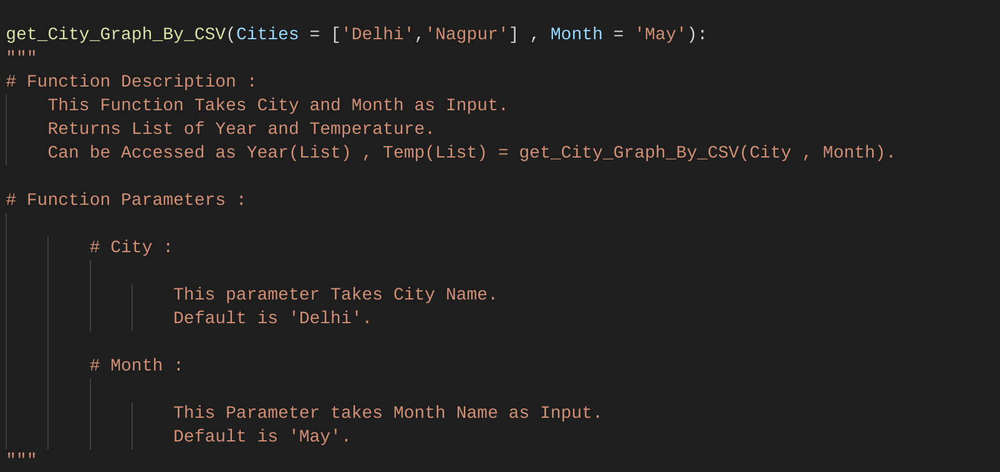
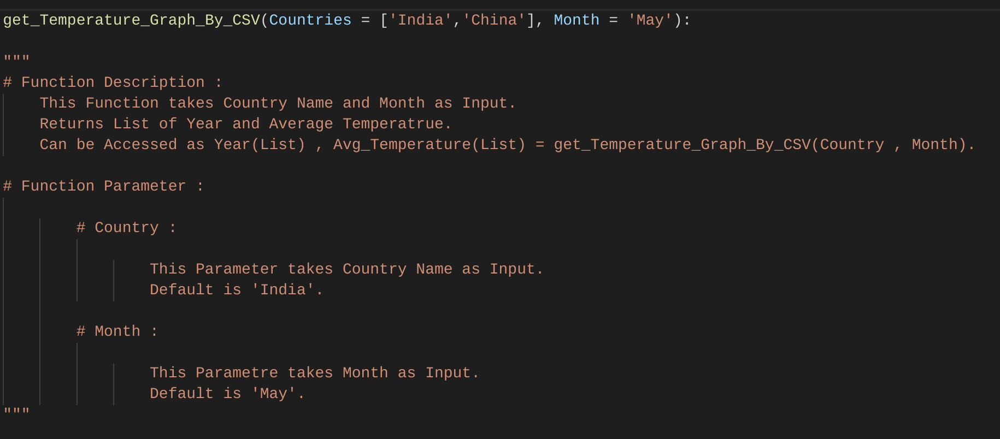
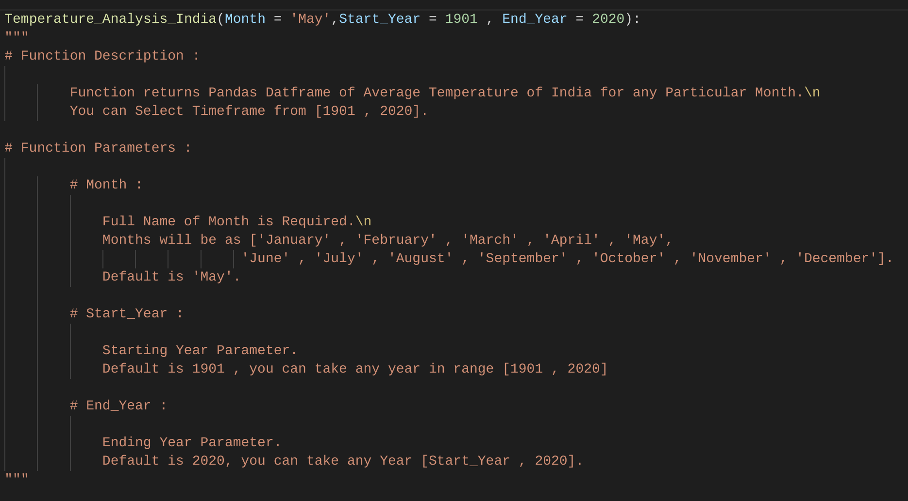
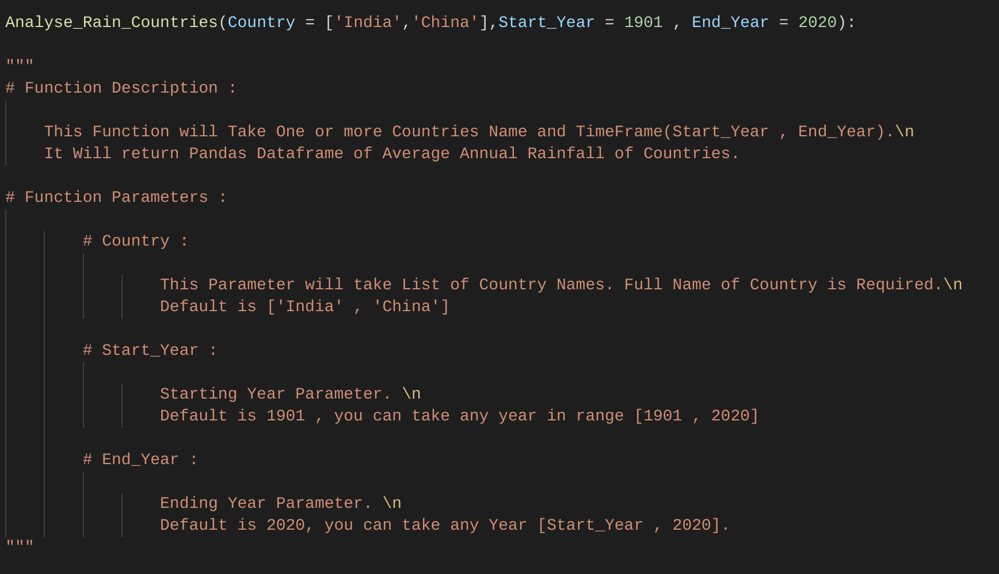
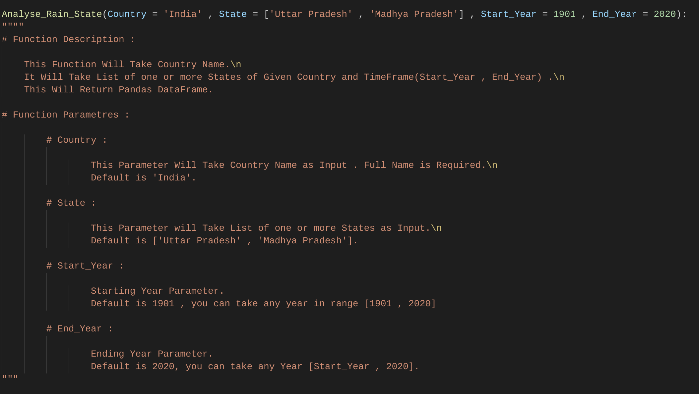

# Climate Analysis portal

+ This Portal Analyzes the Change in Tmeperture and Rainfall Patterns of World , Countries , States , Cities.Also Compare them.

---
# Github
One Can Use Portal on Your system . Program is uploaded in github

You can go to Github [Github_Repository](https://github.com/Harsh-Upadhayay/EnviornmentAnalysis)

---
# Datsets 

+ Data is Taken from different Sources 
    * [Climate_KnoledePorta_Dataset](https://climateknowledgeportal.worldbank.org/watershed/161/climate-data-historical)
    * [Kaggle_Dataset](https://www.kaggle.com/berkeleyearth/climate-change-earth-surface-temperature-data?select=GlobalLandTemperaturesByCity.csv)
    * [Data_GOI](https://data.gov.in/catalog/rainfall-india?filters%5Bfield_catalog_reference%5D=1090541&format=json&offset=0&limit=6&sort%5Bcreated%5D=desc)
    * [USA_Dataset](https://kilthub.cmu.edu/articles/dataset/Compiled_daily_temperature_and_precipitation_data_for_the_U_S_cities/7890488?file=25951292)


---

# Module Climate
## Hierarchy is as  shown 

```
Climate
├── Temperature
│   ├── Global.py
│   ├── GlobalWBD.py
│   ├── India.py
│   └── USA.py
└── Precipitation
    └── Rainfall_Analysis
```

---

# Calling Module

```py
import Climate
```
+ Climate Module Contains
    * Temperature module
    * Precipitation Module
---

# Calling Temperature module from Climate

```py
import Climate.Temperature
```
+ Temperature module contains 
    * Global Module 
    * GlobalWBD Module
    * India Module
    * USA Module
---

# From Temperature Module Importing Global Module
```py
import Climate.Temperature.Global as global
```
+ This Module contains 6 Functions

---


* Function of Global Module
```py
import Climate.Temperature.Global as global
global.TemperatureByCountry()
```



---

* Function of Global Module
```py
import Climate.Temperature.Global as global
global.TemperaturesGlobally()
```



---

* Function of Global Module
```py
import Climate.Temperature.Global as global
global.TemperaturesByState()
```



---

* Function of Global Module

```py
import Climate.Temperature.Global as global
global.TemperaturesByCity()
```  



---


* Function of Global Module
```py
import Climate.Temperature.Global as global
global.TemperaturesBySpecificCity()
```


---


* Function of Global Module
```py
import Climate.Temperature.Global as global
global.get_City_Graph_By_CSV()
```


---


* Function of Global Module
```py
import Climate.Temperature.Global as global
global.get_Temperature_Graph_By_CSV()
```


---


# From Temperature importing GlobalWBD

```py
import Climate.Temperature.GlobalWBD as globaWBD
```

* This Module Contains 3 Functions

---


* Function of GlobalWBD Module
```py
import Climate.Temperature.GlobalWBD as globaWBD
globalWBD.TemperatureByCountryWBD()
```


---


* Function of GlobalWBD Module
```py
import Climate.Temperature.GlobalWBD as globaWBD
globalWBD.TemperatureByCountriesWBD()
```


---


* Function of GlobalWBD Module
```py
import Climate.Temperature.GlobalWBD as globaWBD
globalWBD.TemperatureByStateWBD()
```


---


# From Temperature importing India Module

```py
import Climate.Temperature.India as india
```
* This Module contains 1 Function

---

* Function of India
```py
import Climate.Temperature.India as india
india.Temperature_Analysis_India()
```



---


# From Temperature Importing USA Module

```py
import Climate.Temperature.USA as usa
```

* This Module Conatins 2 Functions

---


* Function of USA

```py
import Climate.Temperature.USA as usa
usa.cityAnalysis()
```


---


* Function of USA 

```py
import Climate.Temperature.USA as usa
usa.citiesAnalysis()
```


---


# Calling Precipitation Module from Temperature

```py
import Climate.Precipitation
```
+ This Module Contains 
    * Rainfall_Analyisis Module

---


* Function of Precipitation

```py
import Climate.Precipitation.Rainfall_Analysis as Rain
Rain.Analyse_Rain_Countries()
```



---


* Function of Precipitation

```py
import Climate.Precipitation.Rainfall_Analysis as Rain
Rain.Analyse_Rain_State()
```



---
# Module GUI

+ Interface of Climate Portal is Hosted by Tkinter
+ Module GUI Contains
    + Interface of Modules of Temperature
    + Interface of Modules of Precipitation

---

# Hierarchy of GUI Module

```
GUI
├── interfaceGlobal.py
├── interfaceIndai.py
├── interfaceRain/py
├── interfaceUSA.py
├── interfaceWBD.py
├── Smooth_Rainfall.py
└── Smooth_Temperature.py

```

---

# Working with tkinter

+ Function interface.py


