## Climate Analysis portal

+ This Portal Analyzes the Change in Temperature and Rainfall Patterns of World , Countries , States ,Cities.

+ Also Compare them.

* Created by 
    + [Ayush Chaurasia](https://github.com/Er-Ayush)
    + [Harsh Tripathi](https://github.com/Harsh324)
    + [Harsh Upadhayay](https://github.com/Harsh-Upadhayay)
    + [Niraj Matare](https://github.com/nirajmatere)
    + [Prathamesh patil](https://github.com/prathameshpatil2002)
    

---
## Github
One Can Use Portal on Your system . Program is uploaded on github

You can go to Github [Github_Repository](https://github.com/Harsh-Upadhayay/EnviornmentAnalysis)

---
## [Datasets](https://github.com/Harsh-Upadhayay/EnviornmentAnalysis/tree/main/datasets) 

+ Data is Taken from different Sources 
    * [Climate_KnowledgePortal_Dataset](https://climateknowledgeportal.worldbank.org/watershed/161/climate-data-historical)
    * [Kaggle_Dataset](https://www.kaggle.com/berkeleyearth/climate-change-earth-surface-temperature-data?select=GlobalLandTemperaturesByCity.csv)
    * [Data_GOI](https://data.gov.in/catalog/rainfall-india?filters%5Bfield_catalog_reference%5D=1090541&format=json&offset=0&limit=6&sort%5Bcreated%5D=desc)
    * [USA_Dataset](https://kilthub.cmu.edu/articles/dataset/Compiled_daily_temperature_and_precipitation_data_for_the_U_S_cities/7890488?file=25951292)


---

## Package [Climate](https://github.com/Harsh-Upadhayay/EnviornmentAnalysis/tree/main/Climate)
### Hierarchy is as  shown 

```
Climate
├── Temperature
│   ├── Global.py
│   ├── GlobalWBD.py
│   ├── India.py
│   └── USA.py
└── Precipitation
    └── Rainfall_Analysis
```

---

## Importing Package [Climate](https://github.com/Harsh-Upadhayay/EnviornmentAnalysis/tree/main/Climate)

```py
import Climate
```
+ Climate Package Contains
    * [Temperature](https://github.com/Harsh-Upadhayay/EnviornmentAnalysis/tree/main/Climate/Temperature) Package
    * [Precipitation](https://github.com/Harsh-Upadhayay/EnviornmentAnalysis/tree/main/Climate/Precipitation) Package
---

## Importing [Temperature](https://github.com/Harsh-Upadhayay/EnviornmentAnalysis/tree/main/Climate/Temperature) Package from [Climate](https://github.com/Harsh-Upadhayay/EnviornmentAnalysis/tree/main/Climate) Package

```py
import Climate.Temperature
```
+ Temperature package contains 4 Modules
    * [Global](https://github.com/Harsh-Upadhayay/EnviornmentAnalysis/blob/main/Climate/Temperature/Global.py)
    * [GlobalWBD](https://github.com/Harsh-Upadhayay/EnviornmentAnalysis/blob/main/Climate/Temperature/GlobalWBD.py)
    * [India](https://github.com/Harsh-Upadhayay/EnviornmentAnalysis/blob/main/Climate/Temperature/India.py)
    * [USA](https://github.com/Harsh-Upadhayay/EnviornmentAnalysis/blob/main/Climate/Temperature/USA.py)
---

## From [Temperature](https://github.com/Harsh-Upadhayay/EnviornmentAnalysis/tree/main/Climate/Temperature) package Importing [Global](https://github.com/Harsh-Upadhayay/EnviornmentAnalysis/blob/main/Climate/Temperature/Global.py) Module

+ Can be called as ,
```py
import Climate.Temperature.Global as global
```
+ This Module contains 6 Functions 
as mentioned in upcoming slides

---


* Function [TemperatureByCountry()](https://github.com/Harsh-Upadhayay/EnviornmentAnalysis/blob/main/Climate/Temperature/Global.py#L251)
+ Can be called as  ,
```py
import Climate.Temperature.Global as global
global.TemperatureByCountry()
```
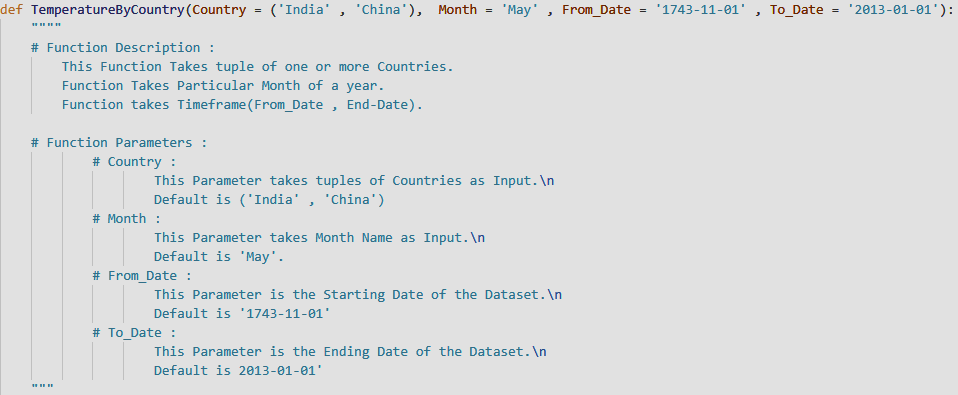


---

* Function [TemperaturesGlobally()](https://github.com/Harsh-Upadhayay/EnviornmentAnalysis/blob/main/Climate/Temperature/Global.py#L208)
+ Can be called as ,
```py
import Climate.Temperature.Global as global
global.TemperaturesGlobally()
```
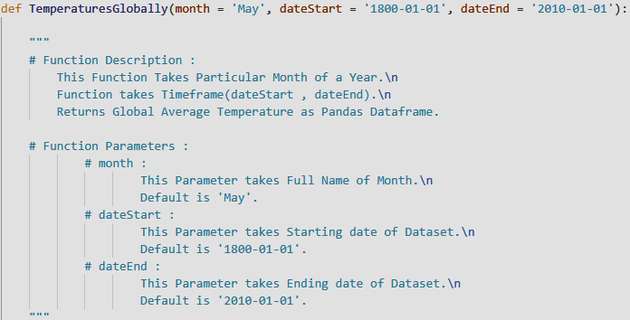


---

* Function [TemperaturesByState()](https://github.com/Harsh-Upadhayay/EnviornmentAnalysis/blob/main/Climate/Temperature/Global.py#L16)
+ Can be called as ,
```py
import Climate.Temperature.Global as global
global.TemperaturesByState()
```
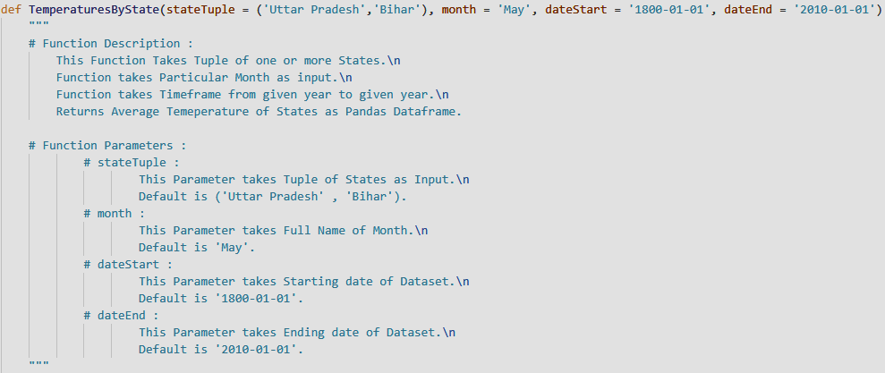


---

* Function [TemperaturesByCity()](https://github.com/Harsh-Upadhayay/EnviornmentAnalysis/blob/main/Climate/Temperature/Global.py#L77)

+ Can be called as ,

```py
import Climate.Temperature.Global as global
global.TemperaturesByCity()
```  
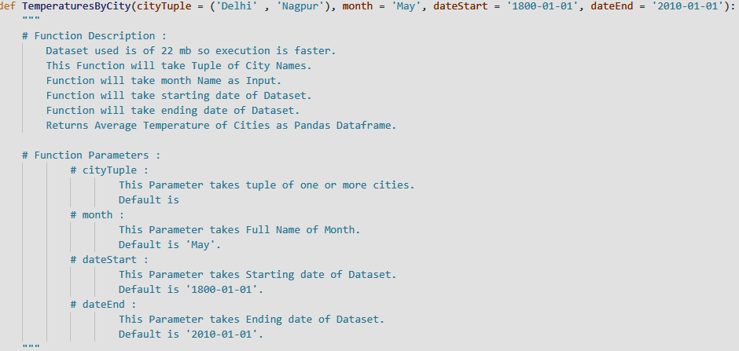


---


* Function [TemperaturesBySpecificCity()](https://github.com/Harsh-Upadhayay/EnviornmentAnalysis/blob/main/Climate/Temperature/Global.py#L146)

+ Can be called as ,

```py
import Climate.Temperature.Global as global
global.TemperaturesBySpecificCity()
```
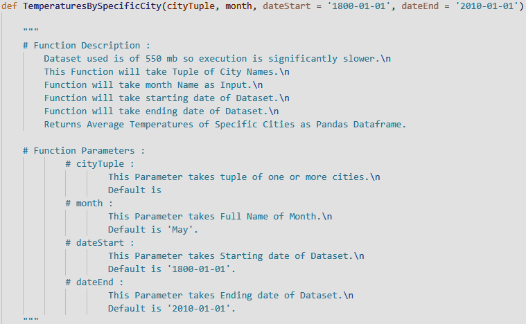

---


* Function [get_City_Graph_By_CSV](https://github.com/Harsh-Upadhayay/EnviornmentAnalysis/blob/main/Climate/Temperature/Global.py#L319)

+ Can be called as , 

```py
import Climate.Temperature.Global as global
global.get_City_Graph_By_CSV()
```
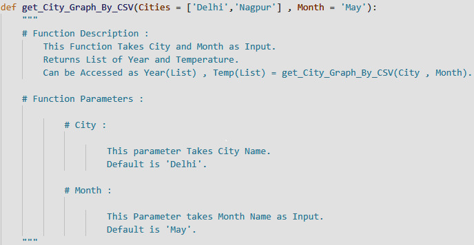

---


* Function [get_Temperature_Graph_By_CSV](https://github.com/Harsh-Upadhayay/EnviornmentAnalysis/blob/main/Climate/Temperature/Global.py#L382)

+ Can be called as , 

```py
import Climate.Temperature.Global as global
global.get_Temperature_Graph_By_CSV()
```
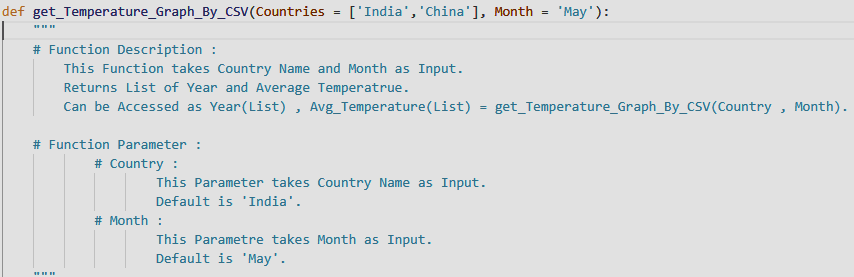

---


## From [Temperature](https://github.com/Harsh-Upadhayay/EnviornmentAnalysis/tree/main/Climate/Temperature) package importing [GlobalWBD](https://github.com/Harsh-Upadhayay/EnviornmentAnalysis/blob/main/Climate/Temperature/GlobalWBD.py) Module

+ Can be called as ,

```py
import Climate.Temperature.GlobalWBD as globalWBD
```

* This Module Contains 3 Functions
as Mentioned in upcoming slides.

---


* Function [TemperatureByCountryWBD()](https://github.com/Harsh-Upadhayay/EnviornmentAnalysis/blob/main/Climate/Temperature/GlobalWBD.py#L35)

+ Can be called as 

```py
import Climate.Temperature.GlobalWBD as globalWBD
globalWBD.TemperatureByCountryWBD()
```
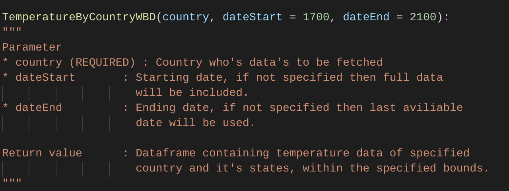

---


* Function [TemperatureByCountriesWBD()](https://github.com/Harsh-Upadhayay/EnviornmentAnalysis/blob/main/Climate/Temperature/GlobalWBD.py#L67)

+ Can be called as , 

```py
import Climate.Temperature.GlobalWBD as globalWBD
globalWBD.TemperatureByCountriesWBD()
```
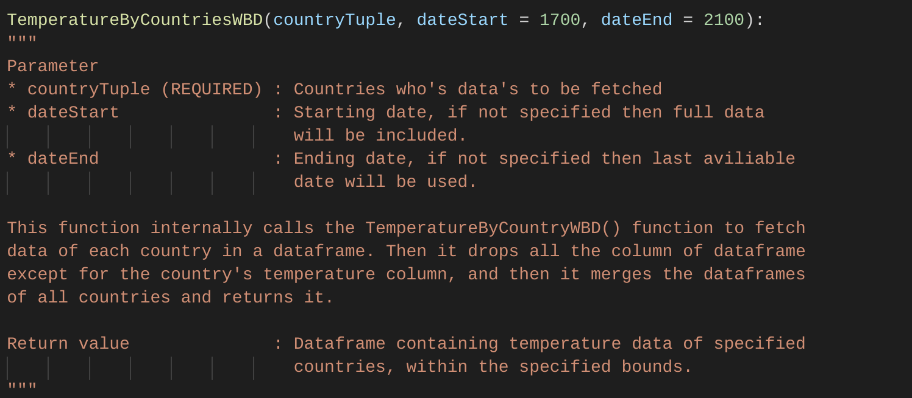

---


* Function [TemperatureByStateWBD()](https://github.com/Harsh-Upadhayay/EnviornmentAnalysis/blob/main/Climate/Temperature/GlobalWBD.py#L106)
```py
import Climate.Temperature.GlobalWBD as globalWBD
globalWBD.TemperatureByStateWBD()
```
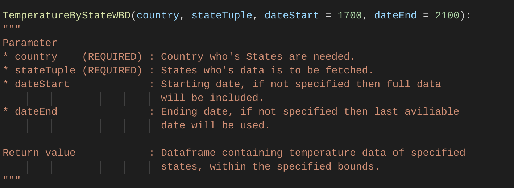

---


## From [Temperature](https://github.com/Harsh-Upadhayay/EnviornmentAnalysis/tree/main/Climate/Temperature) importing [India](https://github.com/Harsh-Upadhayay/EnviornmentAnalysis/blob/main/Climate/Temperature/India.py) Module

+ Module can be called as , 

```py
import Climate.Temperature.India as india
```
* This Module contains 1 Function

---


* Function [Temperature_Analysis_India()](https://github.com/Harsh-Upadhayay/EnviornmentAnalysis/blob/main/Climate/Temperature/India.py#L6)
```py
import Climate.Temperature.India as india
india.Temperature_Analysis_India()
```

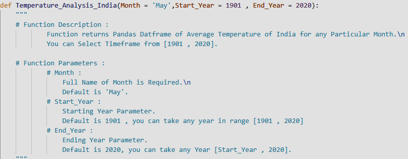

---


## From [Temperature](https://github.com/Harsh-Upadhayay/EnviornmentAnalysis/tree/main/Climate/Temperature) Importing [USA](https://github.com/Harsh-Upadhayay/EnviornmentAnalysis/blob/main/Climate/Temperature/USA.py) Module

```py
import Climate.Temperature.USA as usa
```

* This Module Contains 2 Functions

---


* Function [cityAnalysis()](https://github.com/Harsh-Upadhayay/EnviornmentAnalysis/blob/main/Climate/Temperature/USA.py#L35)

+ Can be called as , 

```py
import Climate.Temperature.USA as usa
usa.cityAnalysis()
```
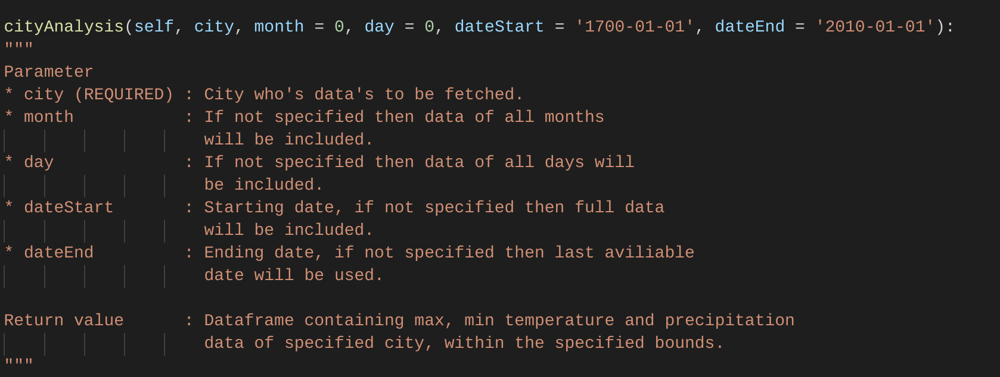

---


* Function [citiesAnalysis()](https://github.com/Harsh-Upadhayay/EnviornmentAnalysis/blob/main/Climate/Temperature/USA.py#L71)

+ Can be Called as , 


```py
import Climate.Temperature.USA as usa
usa.citiesAnalysis()
```

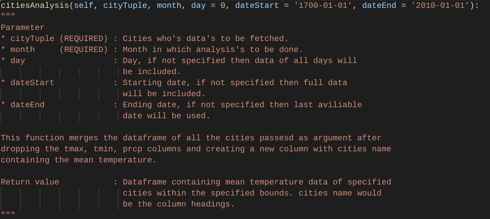

---


## Calling [Precipitation](https://github.com/Harsh-Upadhayay/EnviornmentAnalysis/tree/main/Climate/Precipitation) Module from [Climate](https://github.com/Harsh-Upadhayay/EnviornmentAnalysis/tree/main/Climate)

+ Module can be called as , 

```py
import Climate.Precipitation
```
+ This Module Contains 
    * Rainfall_Analysis Module


---
## From [Precipitation](https://github.com/Harsh-Upadhayay/EnviornmentAnalysis/tree/main/Climate/Precipitation) import [Rainfall_Analysis](https://github.com/Harsh-Upadhayay/EnviornmentAnalysis/blob/main/Climate/Precipitation/Rainfall_Analysis.py) module

+ Can be called as , 

```py
import Climate.Precipitation.Rainfall_Analysis as Rain
```

* This Module contains 2 Functions 
as Mentioned in upcoming slides.

---


* Function [Analyse_Rain_Countries()](https://github.com/Harsh-Upadhayay/EnviornmentAnalysis/blob/main/Climate/Precipitation/Rainfall_Analysis.py#L50)

+ Can be called as , 

```py
import Climate.Precipitation.Rainfall_Analysis as Rain
Rain.Analyse_Rain_Countries()
```

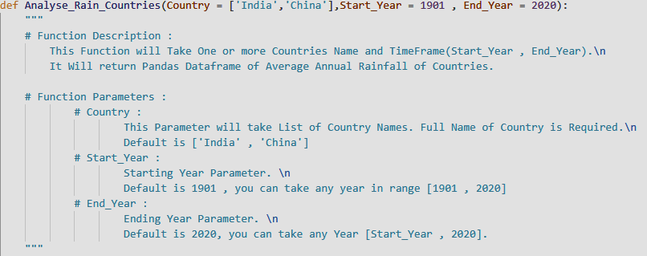

---


* Function [Analyse_Rain_State()](https://github.com/Harsh-Upadhayay/EnviornmentAnalysis/blob/main/Climate/Precipitation/Rainfall_Analysis.py#L104)

+ Can be called as , 

```py
import Climate.Precipitation.Rainfall_Analysis as Rain
Rain.Analyse_Rain_State()
```
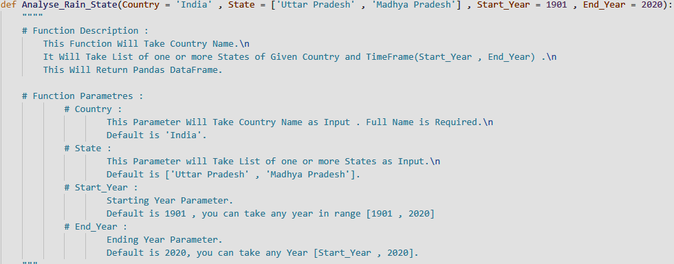


---
## Package [GUI](https://github.com/Harsh-Upadhayay/EnviornmentAnalysis/tree/main/GUI)

* Package can be Imported as , 
```py
import GUI
```

+ Interface of Climate Portal is Hosted by Tkinter
+ Package GUI Contains
    + Interface of Modules of Temperature
    + Interface of Modules of Precipitation

---


## Hierarchy of [GUI](https://github.com/Harsh-Upadhayay/EnviornmentAnalysis/tree/main/GUI) Package

```
GUI
├── interfaceGlobal.py
├── interfaceIndia.py
├── interfaceRain/py
├── interfaceUSA.py
├── interfaceWBD.py


```
* Package [GUI](https://github.com/Harsh-Upadhayay/EnviornmentAnalysis/tree/main/GUI) Contains 4 Modules
as Mentioned in upcoming slides.
---


## Module [interfaceGlobal](https://github.com/Harsh-Upadhayay/EnviornmentAnalysis/blob/main/GUI/interfaceGlobal.py)

+ Module can be imported as , 
```py
import GUI.interfaceGlobal as Interfaceglobal
```
* Some Functions of this Module are ,
    + [kaggle_TA_Country()](https://github.com/Harsh-Upadhayay/EnviornmentAnalysis/blob/main/GUI/interfaceGlobal.py#L16)

    + [kaggle_TA_CountryCSV()](https://github.com/Harsh-Upadhayay/EnviornmentAnalysis/blob/main/GUI/interfaceGlobal.py#L41)

    + [kaggle_TA_State()](https://github.com/Harsh-Upadhayay/EnviornmentAnalysis/blob/main/GUI/interfaceGlobal.py#L64)

    + [kaggle_TA_Cities()](https://github.com/Harsh-Upadhayay/EnviornmentAnalysis/blob/main/GUI/interfaceGlobal.py#L90)

    + [kaggle_TA_CitiesCSV()](https://github.com/Harsh-Upadhayay/EnviornmentAnalysis/blob/main/GUI/interfaceGlobal.py#L116)

---
## Module [interfaceIndia](https://github.com/Harsh-Upadhayay/EnviornmentAnalysis/blob/main/GUI/interfaceIndia.py)

+ Module can be imported as , 
```py
import GUI.interfaceIndia as Interfaceindia
```
* Some Functions of this Module are ,
    + [India_TA](https://github.com/Harsh-Upadhayay/EnviornmentAnalysis/blob/main/GUI/interfaceIndia.py#L17)
    
    + [IndiaBox](https://github.com/Harsh-Upadhayay/EnviornmentAnalysis/blob/main/GUI/interfaceIndia.py#L35)

---

## Module [interfaceRain](https://github.com/Harsh-Upadhayay/EnviornmentAnalysis/blob/main/GUI/interfaceRain.py)

+ Module can be imported as , 
```py
import GUI.interfaceRain as InterfaceRain
```
* Some Functions of this Module are ,
    + [rainfall_by_country()](https://github.com/Harsh-Upadhayay/EnviornmentAnalysis/blob/main/GUI/interfaceRain.py#L14)

    + [rainfall_by_state()](https://github.com/Harsh-Upadhayay/EnviornmentAnalysis/blob/main/GUI/interfaceRain.py#L34)

    + [rainfall_by_country_comparison()](https://github.com/Harsh-Upadhayay/EnviornmentAnalysis/blob/main/GUI/interfaceRain.py#L55)

    + [rainfall_by_state_comparison](https://github.com/Harsh-Upadhayay/EnviornmentAnalysis/blob/main/GUI/interfaceRain.py#L76)
    
---


## Module [interfaceUSA](https://github.com/Harsh-Upadhayay/EnviornmentAnalysis/blob/main/GUI/interfaceUSA.py)

+ Module can be imported as , 
```py
import GUI.interfaceUSA as InterfaceUSA
```
* Some Functions of this Module are ,
    + [USA_TA_City](https://github.com/Harsh-Upadhayay/EnviornmentAnalysis/blob/main/GUI/interfaceUSA.py#L15)

    + [cityBox](https://github.com/Harsh-Upadhayay/EnviornmentAnalysis/blob/main/GUI/interfaceUSA.py#L46)
 
---


## Module [interfaceWBD](https://github.com/Harsh-Upadhayay/EnviornmentAnalysis/blob/main/GUI/interfaceWBD.py)

+ Module can be imported as , 
```py
import GUI.interfaceWBD as InterfaceWBD
```
* Some Functions of this Module are ,

    + [WBD_TA_Country()](https://github.com/Harsh-Upadhayay/EnviornmentAnalysis/blob/main/GUI/interfaceWBD.py#L17)

    + [WBD_TA_State](https://github.com/Harsh-Upadhayay/EnviornmentAnalysis/blob/main/GUI/interfaceWBD.py#L41)

    + [stateBox](https://github.com/Harsh-Upadhayay/EnviornmentAnalysis/blob/main/GUI/interfaceWBD.py#L61)

    + [countryBox](https://github.com/Harsh-Upadhayay/EnviornmentAnalysis/blob/main/GUI/interfaceWBD.py#L96)


---


## Package [Graph](https://github.com/Harsh-Upadhayay/EnviornmentAnalysis/tree/main/Graph)
+ Can be called as 
    ```py
    import Graph
    ```

* This Package is for Plotting Graph of our Program
* This Package Contains two Modules
    + [Smooth_Rainfall](https://github.com/Harsh-Upadhayay/EnviornmentAnalysis/blob/main/Graph/Smooth_Rainfall.py)

    + [Smooth_Temperature](https://github.com/Harsh-Upadhayay/EnviornmentAnalysis/blob/main/Graph/Smooth_Temperature.py)

---


* Module [Smooth_Rainfall](https://github.com/Harsh-Upadhayay/EnviornmentAnalysis/blob/main/GUI/Smooth_Rainfall.py)

    + This Module can be called as ,
    ```py
    import Graph.Smooth_Rainfall as Smooth
    ```

    * This Module is for Graphs
    * Using Matplotlib.pyplot graph is made
    * Graph is smoothed using Scipy library
---


* Functions of [Smooth_Rainfall](https://github.com/Harsh-Upadhayay/EnviornmentAnalysis/blob/main/GUI/Smooth_Rainfall.py)

    + [Get_Graph_Rainfall](https://github.com/Harsh-Upadhayay/EnviornmentAnalysis/blob/main/GUI/Smooth_Rainfall.py#L7)
        + Function can be called as ,
            ```py
            import Graph.Smooth_Rainfall as Smooth
            Smooth.Get_Graph_Rainfall()
            ```

    + [Get_Graph_Rainfall_SubTrue](https://github.com/Harsh-Upadhayay/EnviornmentAnalysis/blob/main/GUI/Smooth_Rainfall.py#L23)

        + Function can be called as ,
            ```py
            import Graph.Smooth_Rainfall as Smooth
            Smooth.Get_Graph_Rainfall_SubTrue()
            ```

---


+ Module[Smooth_Temperature](https://github.com/Harsh-Upadhayay/EnviornmentAnalysis/blob/main/GUI/Smooth_Temperature.py)

    * This Module can be called as , 
    ```py
    import GUI.Smooth_Temperature as smooth
    ```
    + This Module has functions for Plotting graphs
    + Graph is made using Matplotlib , Scipy library 
    + Smoothing of Graph is done by Scipy Library

---
* Functions of [Smooth_Temperature](https://github.com/Harsh-Upadhayay/EnviornmentAnalysis/blob/main/GUI/Smooth_Temperature.py)

    + [Get_Graph_Temperature_India()](https://github.com/Harsh-Upadhayay/EnviornmentAnalysis/blob/main/GUI/Smooth_Temperature.py#L8)

        + Function can be called as ,
        ```py
        import Graph.Smooth_Rainfall as Smooth
        Smooth.Get_Graph_Temperature_India()
        ```

    + [Get_Graph_Temperature_SubTrue()](https://github.com/Harsh-Upadhayay/EnviornmentAnalysis/blob/main/GUI/Smooth_Temperature.py#L34)


    + [Get_Graph_Temperature_SubTrue_Global()](https://github.com/Harsh-Upadhayay/EnviornmentAnalysis/blob/main/GUI/Smooth_Temperature.py#L54)

    + [Get_Graph_Temperature_SubTrue_Global_Csv](https://github.com/Harsh-Upadhayay/EnviornmentAnalysis/blob/main/GUI/Smooth_Temperature.py#L80)

---


## Using the Portal
* Interface is Created using tkinter library

* Driver Function for the Interface is [Interface.py](https://github.com/Harsh-Upadhayay/EnviornmentAnalysis/blob/main/interface.py)

* This Function launches the tkinter mainLoop

---
# Thank you


